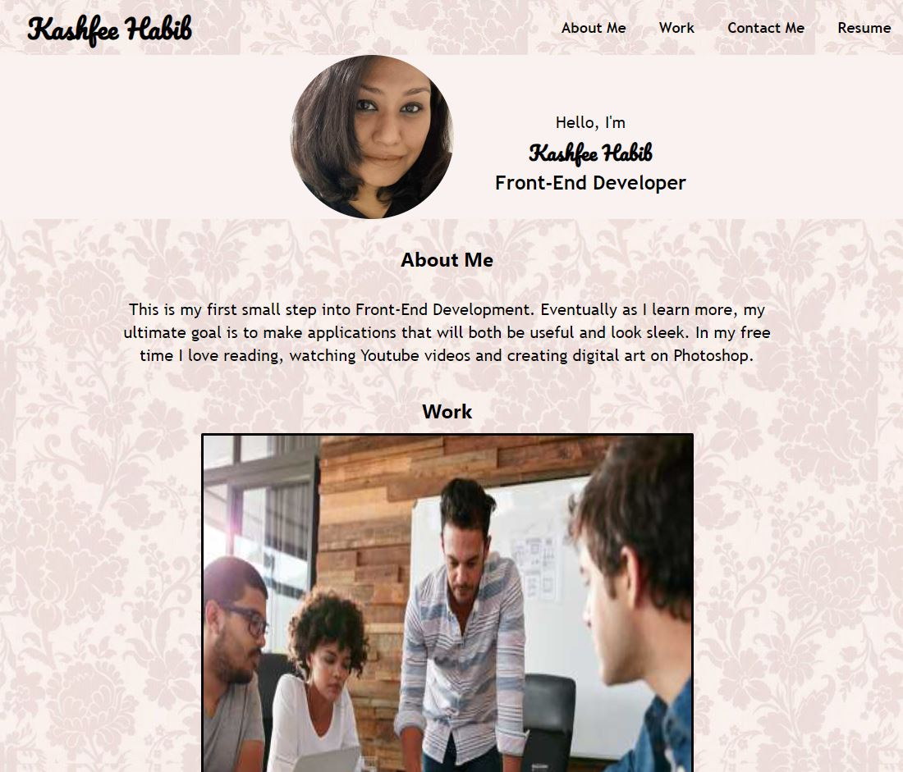
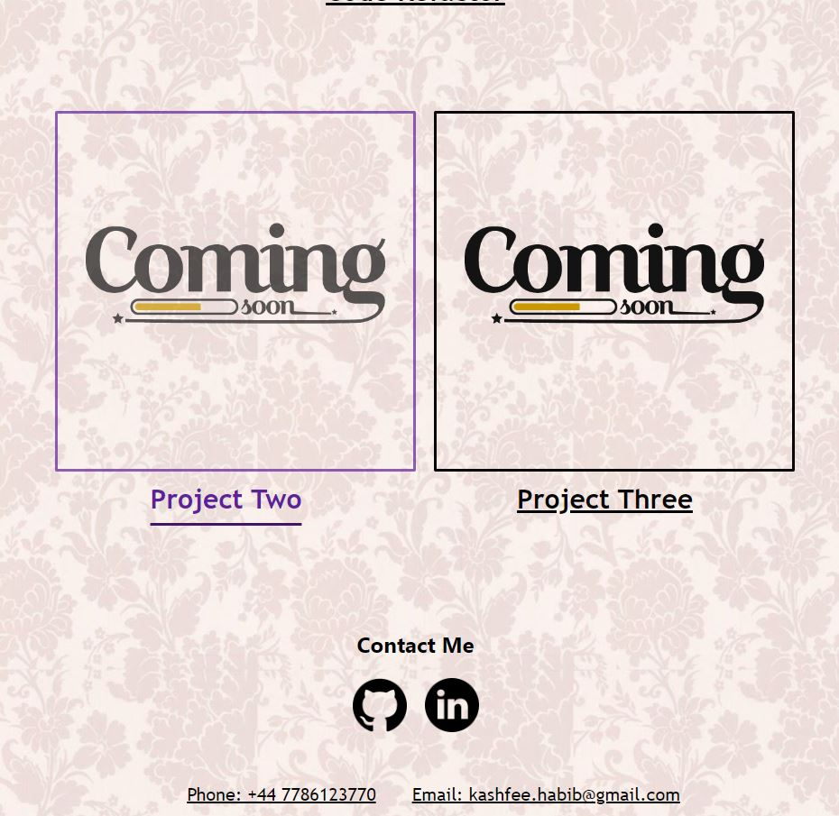
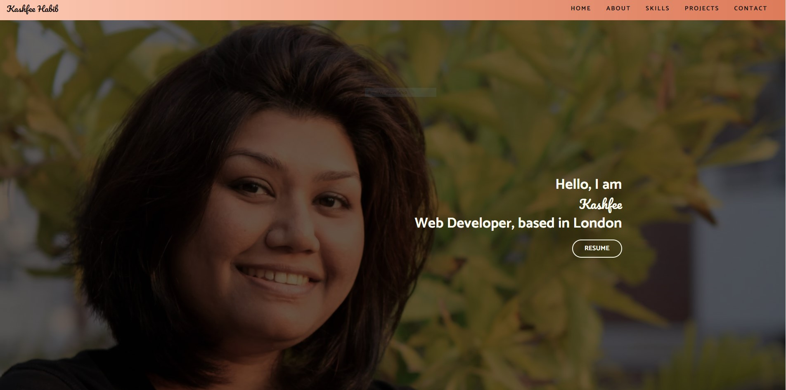
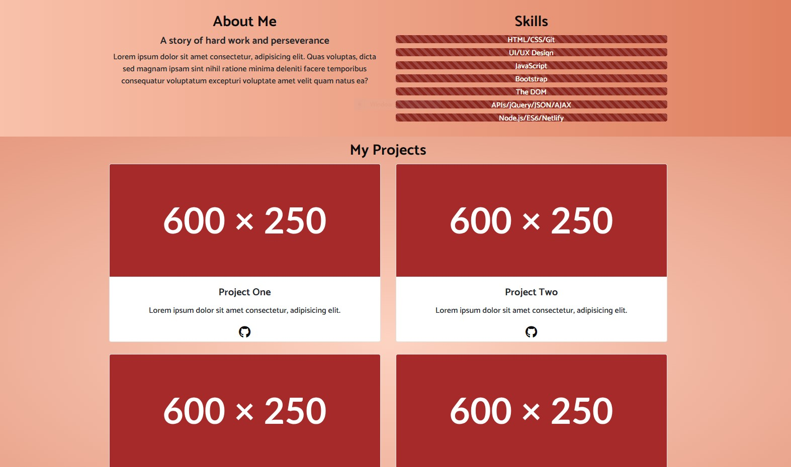

# Module 3: Responsive Portfolio with Bootstrap

## Description

This week's challenge was to use Bootstrap- a free open source front-end development framework and recreate the personal landing page. Instead of writing raw CSS and media queries to that was used create last week's webpage, this challenge proved a lot easier. Though, I am stiil not statisfied with my output but the fact that I am able to use a framework, figure out the necessary classes to use, write HTML/CSS all in a matter a two weeks and created a static page tells me I can do this! I re-designed the webpage becuase I felt my last effort was a bit too simple. It is a step up but there yet. Again, I have learnt quite a bit and I am starting to figure out the pattern/steps that Bootstrap follows. But it did feel sometimes I am fighting agaist the Bootstrap framework becuase it has its own ideas about how something should look.

I also learnt that in Git/Github once a branch is created, only the portion of code planned for that branch should be worked on. No other changes must be made anywhere else in the code. Otherwise, merging conflicts occur. It was a hard lesson learnt and I realized if, for example, two people are trying to alter the same piece of code from different branches, it defeats the purpose of even having the Github facilty. It was created with the target in mind that several people can work on the same tree but diffrent branches and not have clashing codes. Removing merging conflicts is easy enough on this small task however, in larger projects such problems must be avoided. I move on from this project with a deeper understanding of Bootstrap and Git/Github.

##  Usage
For the previous portfolio, please navigate to https://kashfeeh.github.io/Portfolio/ 

For the Portfolio using Bootstrap, please navigate to https://kashfeeh.github.io/Bootstrap-KH-Portfolio/ 

## Contributions
As always, as I am a complete novice in this field, any contributions to improve or correct the work would be highly appreciated. The repository is public. So if you have comments 
or suggestions to make this better, then please follow the steps mentioned below:
* Create a branch for the project
* Create your feature branch (git checkout -b feature/title)
* Commit your Changes (git commit -m 'meesage')
* Push to the branch (git push origin feature/title)
* Open a Pull Request

## License
Distributed under the MIT License. See LICENSE.txt for more information.
